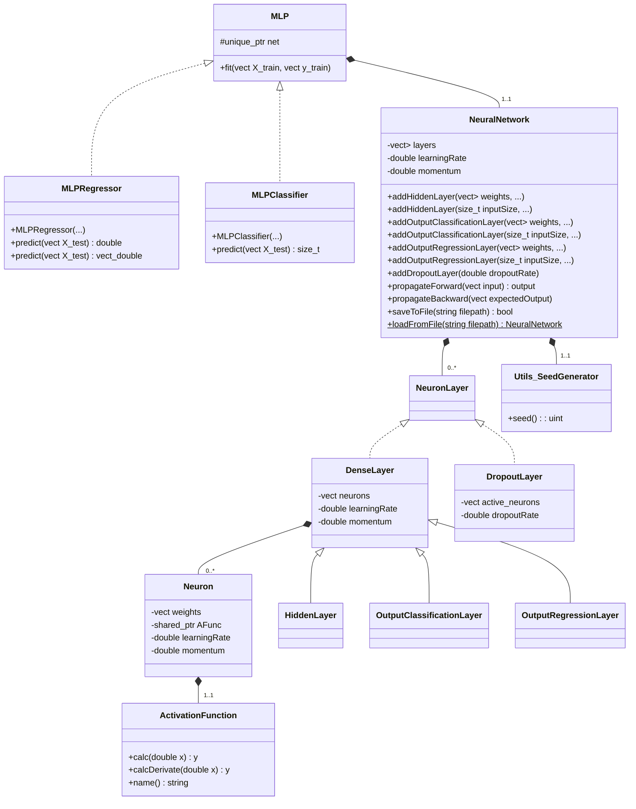

# Yet Another Neural Network Library C++ (YANNL)

## Overview

Main goal of this C++ library is to mimic the behavior of `MLPRegressor` and `MLPClassifier` (Multi-Layer Perceptron) of the Python Scikit-Learn library in C++. It contains all the underlying classes for representing a Multi-Layer Perceptron.
It also includes a very simple XML reader and MNIST file reader. [MNIST] (http://yann.lecun.com/exdb/mnist/) is a database of handwritten digits that the main file uses to demonstrate the possibility of the library.

It uses only the C++ standard library. Compiled with C++14 compiler. No dependencies to other libraries.

## Folder structure

* `data` Dataset used in `main` for demonstrating the possibility of the YANN-Library
    * MNIST handwritten digit database files
    * Iris flower dataset
* `lib`
    * `include` **Header-only library** that you can easily copy/paste into a project
        * `mnist-reader` Utility library for reading the [MNIST handwritten digit database] (http://yann.lecun.com/exdb/mnist/)
        * `neural-net` The Yet Another Neural Network Library including `MLPRegressor` and `MLPClassifier`. See in subsequent section the structure of this folder.
        * `xml-reader` Very simple XML reader. YANN-Library can output a neural network structure to a file and read/load it back. At first I thought about using an XML format for such serialization, but finally ended up with a flat file structure. `neural-net` can thus be used without this XML reader
    * `src` Nothing as the library is currently a **header-only** library
* `main`
    * `include` & `src` Header and source files containing prediction examples using the YANN-Library
        * `IrisClassification` Example of usage of `MLPClassifier` to predict the type of iris flower.
        * `MnistPrediction` Example of usage of the `neural-net` classes to predict the MNIST handwritten digits.
        * `XORPrediction` Example of usage of `MLPRegressor` to predict the output of an XOR gate.
    * `main.cpp` Launches the 3 previous examples: iris classification, MNIST prediction, XOR prediction.
* `test`
    * `expected` Output of unit/regression tests compare to the result files contained in this folder
    * `include/UnitTest.h` Battery of unit/regression tests for the `mnist-reader`, `neural-net` and `xml-reader`. Many methods within the `UnitTest` class have the same name as the files in the `expected` folder: the output of such methods are compared to those files.
    * `src` Nothing as the unit/regression tests are all contained in the header files
    * `test.cpp` The `main' which launches all the test battery.

## Neural network library structure

## Installation and usage

You will find at the root of the project:
* Solution file for Visual Studio 2022
* Workspace file for Code::Blocks

If you would like to launch the main examples (iris classification, MNIST prediction, XOR prediction) set the `main` project as active/startup project (right click > Activate project in C::B, right click > Set as startup project in MS VS).
If you would like to launch the battery of unit/regression tests, set the `test` project as active/startup project.

It is also easy to copy/paste the files into other projects as the library relies only on the STL and the library files are header-only.

## Contributing

Pull requests are welcome. For major changes, please open an issue first
to discuss what you would like to change.

Please make sure to update tests as appropriate.

